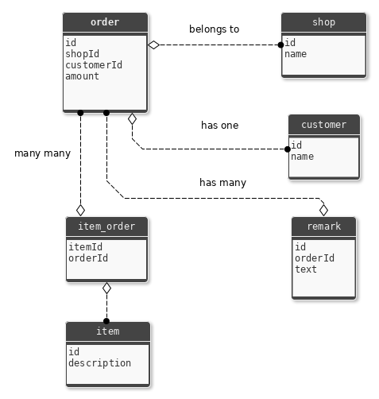

[](http://badge.fury.io/js/sql-dao)
[](https://david-dm.org/loge5/node-sql-dao) 
[](https://david-dm.org/loge5/node-sql-dao?type=dev)

# node-sql-dao

**Data access objects providing an abstract interface to persistence. So you can use them as usual Objects (in OOP) and simply call the "save" method to store them, without messing around with database specific things like SQL statements.**

# Table of Contents
1. [Features](#Features)
2. [Installation](#Installation)
3. [Example DatabaseAccessObject](#Example-DatabaseAccessObject)
4. [Methods (CRUD & Validate)](#Methods-(CRUD-&-Validate))
5. [Relations](#Relations)
6. [Transactions](#Transactions)
7. [Generator](#Generator)
8. [Contributing & Development](#Contributing-&-Development)

# Features

- The *abstract* `DatabaseAccessObject` class providing easy methods for CRUD (create, read, update, delete)
- Also create, read, update, delete relations
- Model validation (required, length, numeric, ...)
- Extendible: add own validators, databases, etc.
- support transactions (rollback)
- **Generate the DAO directly from your database schema**

## TODOs

- Generate relations
- Date-Validator
- Add more databases (for now only **MySQL**)

# Installation

```
npm install sql-dao
```
# Example DatabaseAccessObject

Just extends the `DatabaseAccessObject`

```javascript
const DatabaseAccessObject = require('dao-sql').DatabaseAccessObject
// ... more includes ...

class Example extends DatabaseAccessObject {
  // override the abstact methods
}
```

**Take a look on a complete file: [./Example.js](./Example.js)**

# Methods (CRUD & Validate)

The DatabaseAccessObject provides easy methods for CRUD.

## Create

```javascript
let example = new Example()
example.name = 'Test'
await example.insert()
console.log('inserted with PK: ' + example.id)
```

## Read
```javascript
// find all
let examples = await Example.find()

// find some
let whereClause = new WhereClause('?? = ?', ['name','Test']) // will prepare params
let examples2 = await Example.find(whereClause)
```
## Update

```javascript
let example = new Example()
example.id = 1 // PrivateKey
example.name = 'Test2'
await example.update()

/*
 * create or on duplicate update
 * e.g. when name is unique constraint in db
 */ 
let example = new Example()
example.name = 'Test2'
await example.save()
```

## Delete

```javascript
let example = new Example()
example.id = 1 // PrivateKey
await example.delete()
```

## Validate
```javascript
let example = new Example()
example.name = 'Test'
if (example.validate()) {
  example.save()
} else {
  console.error(example.errors.join("\n"))
}
```

# Relations

For defining relations you can override the `getRelations` method.

**Example:**



```javascript
// ...
class Order extends DatabaseAccessObject {
  /**
   * @returns {Relation[]}
   */
  static getRelations () {
    return [
      new RelationBelongsTo('shop', 'shopId', Shop, 'id'),
      new RelationHasOne('customer', 'customerId', Customer, 'id'),
      new RelationHasMany('remarks', 'id', Remark, 'orderId'),
      new RelationManyMany('items', 'id', Item, 'id', 'item_order', 'orderId', 'itemId')
    ]
  }
  // ...
}
```
Complete file: [./example/Order.js](./example/Order.js)

## Notices about relations

### find

* will fetch any referenced objects
* ⚠️ Don't create recursive relations (e.g. belongsTo in Order & hasOne in Shop)

### insert

* will insert any new referenced objects and relations (ManyMany)
* will update existing referenced objects

### update

* will insert referenced objects with undefined primary key
* will update referenced objects with defined primary key
* will delete "hasMany" referenced objects (when removed from array)
* will delete "ManyMany" **relations** (when removed from array)
* will not delete missing referenced objects on "hasOne" or "belongsTo"

### delete

* only deletes "hasMany" and relations from "ManyMany", rest could be used somewhere else
* for other you can override the beforeDelete/afterDelete methods

### save

* will save (insert on duplicate update) referenced objects
* will delete "hasMany" referenced objects (when removed from array)
* will delete "ManyMany" **relations** (when removed from array)
* will not delete missing referenced objects on "hasOne" or "belongsTo"

# Transactions

```javascript
/*
 * When an statement fails, rollback previous statements
 */
let dbConn = Example.getDatabaseConnection()
let transaction = dbConn.createTransaction()
let example1 = new Example()
let example2 = new Example()
try {
  await example1.insert(transaction)
  await example2.insert(transaction)
  await dbConn.commitTransaction(transaction)
} catch (e) {
  await dbConn.rollbackTransaction(transaction)
}
```

# Generator

create config file for database (see [https://www.npmjs.com/package/mysql](https://www.npmjs.com/package/mysql)):

```javascript
// just an example
module.exports = {
  host: '127.0.0.1',
  user: 'root',
  password: '',
  database: 'dao_example'
}
```

then call from command line:
```Shell
node ./node_modules/sql-dao/gen-mysql.js <path to dbConfigFile> <tableName> <targetPath>
```

Example:
```Shell
node ./node_modules/sql-dao/gen-mysql.js ./config/dbconf.js example ./lib
```

For an example output see [./Example.js](./Example.js)

# Contributing & Development

## Style

[https://github.com/standard/standard](https://github.com/standard/standards)

## Testing

Run mocha tests:

`npm test`

Check code coverage (creates "./coverage/index.html"):

`npm run-script cover`
